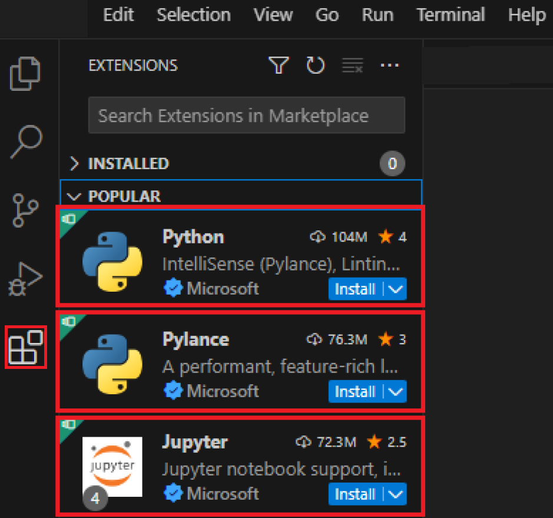
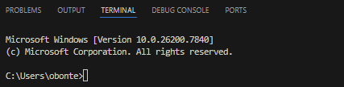
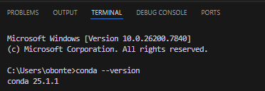
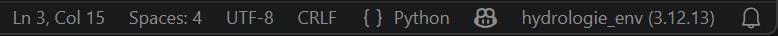
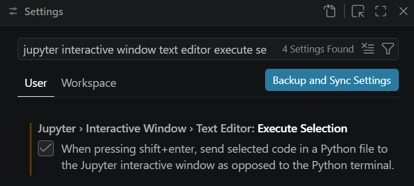
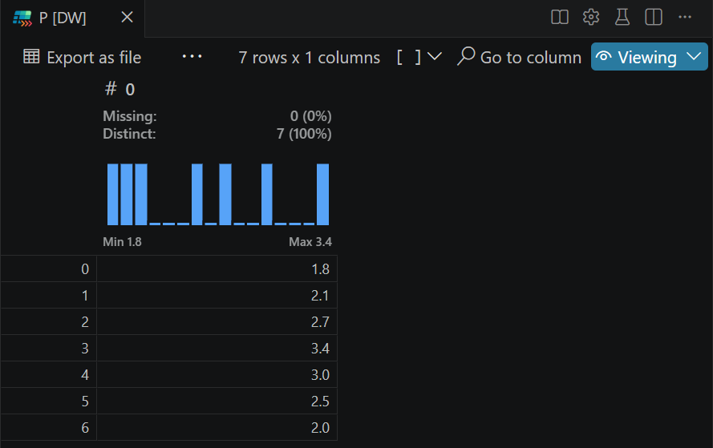

*As of 18/09/2026, this guide is in Dutch and tailored to the course Hydrology in the 3rd year of the Bachelor's program.*

# Waarom deze handleiding?

Visual Studio Code (VS Code) is een code-editor (*Integrated Development Environment* of 
IDE) waarmee je zowel Python- als R-code kan schrijven en uitvoeren. In het eerste bachelorjaar leerde je al hoe je VS Code installeert en gebruikt als Python-IDE. Deze handleiding herhaalt kort de basis en toont daarna hoe je geavanceerdere Python-code transparant en reproduceerbaar kan delen en bewaren.

Python-code gebruikt vaak pakketten (*packages*) met specifieke versies. Na updates kunnen pakketten of Python-versies soms niet meer goed samenwerken. Zelfs als ze technisch nog samenwerken, kan de syntax of werking van functies veranderd zijn, waardoor oude code toch fouten geeft. Daarom werk je best met een lokale *environment*: een omgeving waarin alle nodige pakketten en versies voor één project of vak samen zitten. Zo kan je de code later opnieuw gebruiken of delen zonder dat andere Python- of pakketversies problemen veroorzaken. Voor de programmeertaal R bestaan *environments* ook, maar deze zijn minder vaak nodig omdat de pakketten sterker centraal gecontroleerd worden op compatibiliteit via CRAN.

# Installeer de software

Volg de installatie-instructies hieronder als de software niet meer op je computer staat. Als bepaalde software nog op je computer staat, maar je ervaart problemen, dan kan het helpen om de software eerst te verwijderen en nadien de nieuwste versies opnieuw te installeren zoals hieronder aangegeven. Je leert hieronder:

- Anaconda en een *Python Interpreter* installeren

- VS Code installeren

## Anaconda + Python interpreter

Een *Python Interpreter* is een programma dat Python code kan uitvoeren. Anaconda is een populair softwareplatform voor wetenschappelijk programmeren dat automatisch een *Python* en *R* *interpreter* installeert, maar ook het beheer van pakketten vergemakkelijkt. Als je Anaconda installeert, hoef je dus niet apart een *Python Interpreter* te installeren.

Installeer Anaconda via deze stappen:

1.  Surf naar [anaconda.com/download/success](https://www.anaconda.com/download/success);

2.  Download de juiste *Anaconda Distribution Graphical Installer* voor jouw besturingssysteem

3.  Open de installer

4.  Klik op *I Agree*, *Next* en uiteindelijk *Install* 

5.  Open de software *Anaconda Prompt*

6. Voor een Windows systeem, voer het commando `conda init powershell`
  uit. Voor Mac/Linux gebruikers, gebruik het commando `conda init bash`. 

7.  Sluit *Anaconda Prompt*

## VS Code

Installeer VS Code via deze stappen:

1.  Surf naar [code.visualstudio.com/download](https://code.visualstudio.com/download)

2.  Selecteer je besturingssysteem

3.  Open de *installer*

4.  Klik *Next* en uiteindelijk *Install*

## VS Code extensies

VS Code kan uitgebreid worden met extensies die het programmeren vergemakkelijken of extra mogelijkheden bieden. Installeer nieuwe extensies in VS Code als volgt:

1.  Start VS Code

2.  Ga naar *View* \> *Extensions*

3.  Zoek voor het vak hydrologie minstens de extensies *Python*, *Pylance*, *Jupyter* en *Data Wrangler*

4.  Klik telkens op *Install*

{width="7.5cm"}

## Controleer de installatie van *conda*

Soms moet je bewerkingen doen die niet 'in' je Python- of R-code staan, maar die daarbuiten gebeuren, zoals een specifiek script uitvoeren, pakketten installeren of *environments* creëren. VS Code voorziet daarvoor een *terminal*, een venster waarmee je commando's kan geven aan jouw besturingssysteem, zonder je muis te gebruiken. Zo kan je bijvoorbeeld de software *conda* aansturen via de terminal om pakketten en *environments* te beheren. Voer deze stappen uit om een terminal te openen en hiermee te controleren of de software *conda* correct geïnstalleerd is:

1.  Ga naar *View* \> *Command Palette...*

2.  Typ *Terminal: Create New Terminal*

3.  Klik op de pop-up die verschijnt

4.  Controleer of er onderaan een scherm opent dat lijkt op de onderstaande schermopname^[Onderstaande afbeelding is voor Windows, voor Mac/Linux kan dit er licht anders uitzien].



5.  Voer deze code uit in de terminal

``` powershell
conda --version
```

6.  Controleer of je *conda xx.x.x* als antwoord krijgt, vergelijkbaar met de onderstaande schermopname

{width="8.7cm"}

7.  Als het antwoord *command not found: conda* is, volg dan de instructies op [anaconda.com/docs/getting-started/working-with-conda/environments#troubleshooting](https://www.anaconda.com/docs/getting-started/working-with-conda/environments#troubleshooting)

# Configureer VS Code

In deze sectie leer je hoe je VS Code configureert om te kunnen gebruiken voor het vak Hydrologie. Veel van de instellingen kan je ook gebruiken voor andere vakken in de opleiding Ecosysteembeheer. Je leert hier:

- een werkmap (*Working Directory*) selecteren in VS Code

- een *environment* creëren en gebruiken die een lesgever deelt, waarin alle nodige, compatibele pakketten zitten die nodig zijn voor een vak

- een script uitvoeren via een geselecteerde *environment* en de geïnstalleerde extensies gebruiken

## Selecteer de *Working directory*

De werkmap (*Working Directory*) is de map op je computer waarin VS Code momenteel standaard alle bestanden zoekt, leest en opslaat als je code uitvoert. Als je deze niet bewust kiest, leidt dit typisch tot foutmeldingen zoals '*file not found*' of vind je de figures/python_vs_code niet terug die je hebt gemaakt met Python. Selecteer de werkmap als volgt:

1.  Ga naar *File* \> *Open folder ...*

2.  Navigeer naar de map waarin je script(s), data en andere bestanden staan waarmee je wil werken

3.  Klik *Select Folder*

4.  Selecteer *Yes, I trust the authors* als dit gevraagd wordt

## Creëer een *environment* via een YAML-bestand

De Python-pakketten die nodig zijn om een bepaald script uit te kunnen voeren kunnen gedeeld worden tussen gebruikers via een YAML-bestand (`.yml` of `.yaml` extensie). Dit bestand bevat een overzicht van de nodige pakketten en versies om een *environment* aan te maken. Nadat je een *environment* hebt gecreëerd op je computer, blijft het beschikbaar binnen VS Code. Hieronder wordt als voorbeeld uitgelegd hoe je het *environment* kan aanmaken dat je voor alle werkcolleges en taken van het vak hydrologie moet gebruiken:

1.  Download het bestand `hydrologie_env.yml` van Ufora

2.  Kies de map met dit bestand als *Working Directory*

3.  Voer deze code uit in de terminal van VS Code en wacht tot de *environment* gecreëerd is

``` powershell
conda env create -f hydrologie_env.yml
```

4.  Maak een nieuw `.py`-bestand aan: *File \> New File... \> Python File*

5.  Sla het `.py`-bestand op onder een naam naar keuze in je working directory

6.  Ga naar *View* \> *Command Palette...*

7.  Typ *Python: Select Interpreter*

8.  Klik op de net gecreëerde `hydrologie_env` om deze *environment* te gebruiken voor dit py-bestand

9.  Controleer of je rechts onderaan het VS Code scherm de naam van de gekozen environment ziet, zoals in de schermopname hieronder. Als je hier *base* ziet staan, dan is de standaard Python-*environment* die meekomt met Anaconda nog geactiveerd. Controleer de gebruikte *environment* telkens voordat je een script runt

{width="14cm" height="0.7cm"}

## Voer een volledig Python script uit

1.  Kopieer deze Python-code in het py-bestand via het klembord-icoon

```{python}
#| output: false 
import numpy as np # Open een pakket om te werken met vectoren/matrices 
import matplotlib.pyplot as plt # Open een pakket om figures/python_vs_code te maken 

t = np.arange(1, 8) #[d] Maak een vector met dagen tussen 1 en 8 (excl. 8)
P = np.array([1.8, 2.1, 2.7, 3.4, 3.0, 2.5, 2.0]) #[mm/d] Maak een vector met dagelijkse nee rslaghoogtes

print(f'Gemiddelde dagelijkse neerslaghoogte: {np.mean(P):.1f} mm') # Toon de gemiddelde dagelijkse neerslaghoogte

fig = plt.figure() # Maak een nieuwe figuur
plt.plot(t, P, marker = '.', linestyle = 'None', color = 'black') # Maak een spreidingsdiagram met zwarte punten 
plt.xlabel('Tijd (dagen)') # Maak een titel voor de x-as
plt.ylabel('Dagelijkse neerslaghoogte [mm]') # Maak een titel voor de y-as
plt.show() # Toon de grafiek in de output
```

2.  Voer het volledige script uit door te klikken op het pijl-icoon {width="0.6cm" height="0.3cm"}

3.  Controleer of je onderstaande output krijgt

```{python}
#| echo: false
print(f'Gemiddelde dagelijkse neerslaghoogte: {np.mean(P):.1f} mm') # Toon de gemiddelde dagelijkse neerslaghoogte
fig
```

## Voer een selectie van een Python script uit en bekijk variabelen

Bij lange of rekenintensieve scripts is het tijdrovend om bij elke aanpassing het volledige script opnieuw uit te voeren. Met de *Jupyter* extensie kan je een selectie van je code uitvoeren om snel iets te testen. *Jupyter* laat ook toe om de waarde(n) van variabelen te bekijken, zelfs als ze niet in de output van het script terecht komen. De extensie *Data Wrangler* stelt je bovendien in staat om variabelen met veel data in tabelvorm te bekijken. Voer hiervoor de volgende stappen uit:

1.  Ga naar *File* \> *Preferences* \> *Settings*

2.  Zoek naar *Jupyter Interactive Window Text Editor Execute Selection*

3.  Vink deze optie aan

{width="8.7cm" height="4cm"}

4.  Selecteer het volledige script met je cursor en toets *shift + enter*

5.  Klik op *Jupyter Variables* in de nieuwe *Jupyter Interactive Window*. Als *Jupyter Variables* niet meteen zichtbaar is, klik dan op de puntjes: 

{width="10.9cm"}

6.  Controleer of je onderstaande variabelen ziet staan


7.  Dubbelklik op één van de variabelen om via *Data Wrangler* de variabele als een tabel te bekijken

{width="11.1cm"}

8.  Pas dan alleen het print commando in het py-bestand aan

```{python}
#| eval: false
print(f'Totale neerslaghoogte: {np.sum(P):.1f} mm') # Toon de totale neerslaghoogte over de meetperiode
```

9.  Selecteer alleen het aangepaste commando met je cursor en toets *shift + enter*

10. Controleer of je onderstaande output ziet in de *Jupyter Interactive Window*

```{python}
#| echo: false
print(f'Totale neerslaghoogte: {np.sum(P):.1f} mm') # Toon de totale neerslaghoogte over de meetperiode
```

# Tips voor programmeren

Er zijn ontzettend veel pakketten, functies, methodes, datatypes etc. beschikbaar in Python. Je hoeft deze echter niet allemaal van buiten te kennen om ermee te kunnen werken. Als je niet weet hoe een functie werkt of welke functie voor een bepaalde opdracht geschikt is, dan kan je volgende hulpmiddelen gebruiken, in volgorde van belang:

1.  Gebruik het ingebouwde help-commando als je niet weet welke input parameters een functie verwacht of hoe deze werkt. Meestal helpen de 'Examples' onderaan het best om de basiswerking van een functie snel te begrijpen.

```{python}
#| eval: false
help(np.sum)
```

:::{.callout-note collapse="true" title="Output"}

```{python}
#| eval: true
#| echo: false
help(np.sum)
```

:::

2.  Test commando’s op kleine, fictieve datasets voordat je ze toepast op grote datasets om te begrijpen wat ze doen

```{python}
#| eval: false
np.array([0,-1,1]) > 0
```

::: {.callout-note collapse="true" title="Output"}

```{python}
#| eval: true
#| echo: false
np.array([0,-1,1]) > 0
```

:::

3.  [Voer een selectie van een Python script uit en bekijk variabelen] om te controleren of je commando's het gewenste effect hebben

4.  Vraag hulp aan medestudenten of begeleiders

5.  Gebruik Google om documentatie en voorbeelden van het gebruik van commando's op te zoeken

6.  Gebruik GenAI. Hou hierbij rekening met de [richtlijnen voor verantwoord gebruik van GenAI van de UGent](https://www.ugent.be/nl/univgent/missie/genai). Specifiek geldt hier een verbod om de data te delen die je van de lesgevers krijgt. Wees je bewust van de nadelen van GenAI voor oefeningen, zoals: 

- het kan je motivatie verminderen
- het kan je leerproces verhinderen, waardoor je tijdens het semester misschien sneller resultaten bekomt maar tijdens het examen minder goed kan antwoorden op vragen
- het verbruikt veel energie, terwijl gelijkaardige info waarschijnlijk al ergens op het internet staat

Je bent nu klaar voor het eerste werkcollege van Hydrologie! Hieronder staat optionele extra informatie die handig kan zijn voor je taken of voor andere vakken.

# Beheer zelf *environments* (optioneel)

## Maak *environments* aan

Je kan zelf nieuwe *environments* aanmaken als de base-*environment* of *environment* gedeeld door een lesgever niet voldoet aan je noden. Maak eerst een nieuw YAML-bestand aan met de pakketten die je wil gebruiken. Je hoeft de pakket-versies niet per sé te specifiëren. De software conda controleert automatisch welke versies van de nodige pakketten onderling compatibel zijn en installeert deze. Er worden ook automatisch andere pakketten geïnstalleerd die niet expliciet in de YAML staan als deze nodig zijn om de gevraagde pakketten te laten werken.

1.  Ga naar *File* \> *New Text File* \> *Save as* \> Zoek de huidige *Working Directory* \> Kies als naam bijvoorbeeld `example_env` en kies bij *Opslaan als YAML*

2.  Gebruik onderstaande syntax en vul de lijst met pakketten aan naar wens

``` yaml
name: example_env
channels:
  - conda-forge
dependencies:
  - python
  - numpy
  - matplotlib
```

3.  Voer onderstaande code uit in de terminal van VS Code en wacht tot de *environment* gecreëerd is

``` powershell
conda env create -f example_env.yml
```

4.  Voer deze code uit in de terminal om de *environment* te activeren (hiermee wordt je openstaande python script niet per sé uitgevoerd via deze *environment*, maar kan je via de terminal aanpassingen maken aan deze *environment*)

``` powershell
conda activate example_env
```

## Deel *environments* transparant en reproduceerbaar

Als je een YAML-bestand zonder versies specifieert bestaat het risico dat ditzelfde bestand tot andere versies leidt als iemand hiermee op een ander moment een *environment* maakt. Als je dit wil voorkomen, moet je de versies die je gebruikt mee in het YAML-bestand zetten. Het laatste cijfer van een versie, zoals de '3' in '2.1.3' hoef je niet te vermelden. Dit is de patch-versie en verandert gewoonlijk geen syntax.

1.  Voer onderstaande code uit in de terminal om te zien welke versies in je actieve environment staan

``` powershell
conda list
```

2.  Zoek de pakketten die in je YAML-bestand staan en kopieer hun hoofd- en onderversie (de eerste 2 cijfers) naar het YAML-bestand, zoals in het voorbeeld hieronder

``` yaml
name: example_env
channels:
  - conda-forge
dependencies:
  - python=3.13
  - numpy=2.3
  - matplotlib=3.10
```

3.  Bewaar en deel dit bestand samen met het programmeerproject waarvoor je het gebruikt

## Verwijder *environments*

Je kan *environments* als volgt van je computer verwijderen:

1.  Voer onderstaande code uit in de terminal om alle *environments* te deactiveren

``` powershell
conda deactivate
```

2.  Voer onderstaande code uit in de terminal om de *environment* met naam *example_env* te verwijderen van je computer

``` powershell
conda remove --name example_env --all
```

# Pandas (optioneel)

Welke functies je precies gebruikt voor de oefeningen en taken van het vak Hydrologie, doet er niet toe voor de evaluatie. Je wordt enkel geëvalueerd op het inzicht in je eigen code, het eindresultaat en de transparantie en reproduceerbaarheid. Het pakket Pandas is echter wel een aanrader voor de analyse van tijdreeksen. Dit pakket is een uitbreiding op NumPy, die veel typische bewerkingen op grote datasets vereenvoudigd, zoals filteren, groeperen en sorteren, vergelijkbaar met *tidyverse* in R. Een introductie tot Pandas vind je hier: [pandas.pydata.org/pandas-docs/stable/user_guide/10min](https://pandas.pydata.org/pandas-docs/stable/user_guide/10min).

# Quarto (optioneel)

Als je een wetenschappelijk verslag schrijft in Word of Latex, kan je je Python-code als bijlage toevoegen voor transparantie en reproduceerbaarheid. Met de software Quarto kan je beide tegelijk: je kan hiermee stukken opgemaakte tekst schrijven, afgewisseld met stukken Python- (of R-)code. Je kan een quarto-document omzetten (*renderen*) naar een HTML, PDF of Word-bestand en daarbij de output van de code automatisch tonen in het rapport, al dan niet samen met de code zelf. Deze handleiding werd op die manier gemaakt. Meer info over hoe je Quarto kan gebruiken in VS Code vind je op [quarto.org/docs/tools/vscode/index.html](https://quarto.org/docs/tools/vscode/index.html).